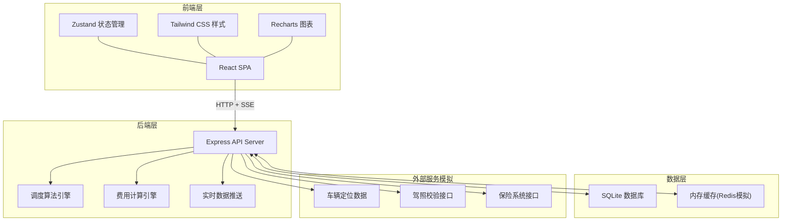
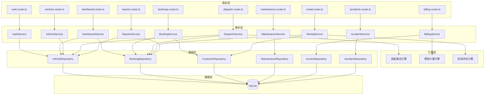
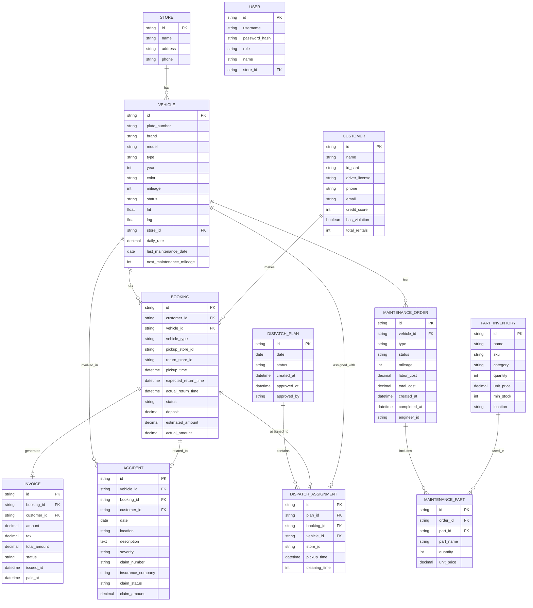

# 汽车租赁集团智能调度与运营管理系统 - 技术架构文档

## 1. 架构设计

系统采用前后端分离架构，前端使用 React + TypeScript + Vite，后端使用 Express + TypeScript，数据层使用 SQLite 存储，支持实时数据更新。



## 2. 技术描述

- **前端技术栈**: React@18 + TypeScript + Vite + TailwindCSS@3 + Zustand + React Router
- **UI组件**: Lucide React 图标 + Recharts 图表
- **后端技术栈**: Express@4 + TypeScript
- **数据库**: SQLite (通过 better-sqlite3 访问)
- **实时通信**: Server-Sent Events (SSE)
- **PDF导出**: jsPDF
- **地图展示**: Leaflet (开源地图库)
- **初始化工具**: vite-init
- **包管理器**: npm

## 3. 路由定义

| 路由路径 | 页面名称 | 说明 |
|----------|----------|------|
| /dashboard | 驾驶舱首页 | 数据概览、实时地图、关键指标 |
| /dispatch | 智能调度中心 | 调度方案生成、审批、推送 |
| /bookings | 预订管理 | 预订列表、客户管理 |
| /vehicles | 车辆管理 | 车辆档案、实时状态、定位 |
| /maintenance | 维保管理 | 工单管理、配件库存 |
| /rental | 取还车管理 | 取车流程、还车流程 |
| /billing | 费用结算 | 结算中心、发票管理 |
| /reports | 统计报表 | 数据统计、PDF月报 |
| /accidents | 事故管理 | 事故处理、保险理赔 |
| /settings | 系统设置 | 基础数据、权限管理 |
| /login | 登录页 | 用户登录 |

## 4. API 定义

### 4.1 数据类型定义

```typescript
// 车辆信息
interface Vehicle {
  id: string;
  plateNumber: string;
  brand: string;
  model: string;
  type: string; // 经济型/舒适型/豪华型/SUV
  year: number;
  color: string;
  mileage: number;
  status: 'available' | 'rented' | 'maintenance' | 'cleaning';
  location: {
    lat: number;
    lng: number;
  };
  storeId: string;
  dailyRate: number;
  lastMaintenanceDate: string;
  nextMaintenanceMileage: number;
}

// 客户信息
interface Customer {
  id: string;
  name: string;
  idCard: string;
  driverLicense: string;
  phone: string;
  email: string;
  creditScore: number;
  hasViolation: boolean;
  totalRentals: number;
}

// 预订信息
interface Booking {
  id: string;
  customerId: string;
  vehicleId: string;
  vehicleType: string;
  pickupStoreId: string;
  returnStoreId: string;
  pickupTime: string;
  expectedReturnTime: string;
  actualReturnTime?: string;
  status: 'pending' | 'confirmed' | 'active' | 'completed' | 'cancelled';
  deposit: number;
  estimatedAmount: number;
  actualAmount?: number;
}

// 调度方案
interface DispatchPlan {
  id: string;
  date: string;
  status: 'draft' | 'pending_approval' | 'approved' | 'rejected';
  assignments: DispatchAssignment[];
  createdAt: string;
  approvedAt?: string;
  approvedBy?: string;
}

interface DispatchAssignment {
  bookingId: string;
  vehicleId: string;
  storeId: string;
  pickupTime: string;
  cleaningTime: number; // 清洁时间(分钟)
}

// 维保工单
interface MaintenanceOrder {
  id: string;
  vehicleId: string;
  type: 'routine' | 'repair' | 'inspection';
  status: 'pending' | 'in_progress' | 'completed';
  mileage: number;
  parts: MaintenancePart[];
  laborCost: number;
  totalCost: number;
  createdAt: string;
  completedAt?: string;
  engineerId?: string;
}

interface MaintenancePart {
  partId: string;
  partName: string;
  quantity: number;
  unitPrice: number;
}

// 配件库存
interface PartInventory {
  id: string;
  name: string;
  sku: string;
  category: string;
  quantity: number;
  unitPrice: number;
  minStock: number;
  location: string;
}

// 事故记录
interface AccidentRecord {
  id: string;
  vehicleId: string;
  bookingId?: string;
  customerId?: string;
  date: string;
  location: string;
  description: string;
  severity: 'minor' | 'moderate' | 'severe';
  insuranceClaim: {
    claimNumber: string;
    insuranceCompany: string;
    status: 'filed' | 'processing' | 'approved' | 'rejected';
    amount: number;
  };
  photos: string[];
}

// 发票
interface Invoice {
  id: string;
  bookingId: string;
  customerId: string;
  amount: number;
  tax: number;
  totalAmount: number;
  items: InvoiceItem[];
  status: 'draft' | 'issued' | 'paid';
  issuedAt: string;
  paidAt?: string;
}

interface InvoiceItem {
  description: string;
  quantity: number;
  unitPrice: number;
  amount: number;
}
```

### 4.2 API 接口列表

| 方法 | 路径 | 说明 |
|------|------|------|
| GET | /api/dashboard/stats | 获取驾驶舱统计数据 |
| GET | /api/vehicles | 获取车辆列表 |
| GET | /api/vehicles/:id | 获取车辆详情 |
| PUT | /api/vehicles/:id/status | 更新车辆状态 |
| GET | /api/vehicles/locations | 获取车辆实时位置 |
| GET | /api/bookings | 获取预订列表 |
| POST | /api/bookings | 创建预订 |
| GET | /api/bookings/:id | 获取预订详情 |
| PUT | /api/bookings/:id/status | 更新预订状态 |
| GET | /api/dispatch/plans | 获取调度方案列表 |
| POST | /api/dispatch/generate | 生成调度方案 |
| PUT | /api/dispatch/plans/:id/approve | 审批调度方案 |
| POST | /api/dispatch/plans/:id/push | 推送到门店 |
| GET | /api/maintenance/orders | 获取维保工单列表 |
| POST | /api/maintenance/orders | 创建维保工单 |
| PUT | /api/maintenance/orders/:id/status | 更新工单状态 |
| GET | /api/maintenance/parts | 获取配件库存 |
| POST | /api/rental/pickup | 取车处理 |
| POST | /api/rental/return | 还车处理 |
| GET | /api/rental/check-license | 驾照校验 |
| POST | /api/billing/calculate | 计算费用 |
| GET | /api/billing/invoices | 获取发票列表 |
| POST | /api/billing/invoices/:id/issue | 开具发票 |
| GET | /api/reports/rental-rate | 出租率统计 |
| GET | /api/reports/revenue | 收入统计 |
| GET | /api/reports/failure-rate | 故障率统计 |
| GET | /api/reports/monthly-pdf | 导出月度PDF报表 |
| GET | /api/accidents | 获取事故列表 |
| POST | /api/accidents | 上报事故 |
| GET | /api/customers | 获取客户列表 |
| GET | /api/customers/:id | 获取客户详情 |
| POST | /api/auth/login | 用户登录 |

## 5. 后端架构图



## 6. 数据模型

### 6.1 ER 图



### 6.2 DDL 语句

```sql
-- 门店表
CREATE TABLE stores (
  id TEXT PRIMARY KEY,
  name TEXT NOT NULL,
  address TEXT,
  phone TEXT,
  created_at TEXT DEFAULT CURRENT_TIMESTAMP
);

-- 车辆表
CREATE TABLE vehicles (
  id TEXT PRIMARY KEY,
  plate_number TEXT NOT NULL UNIQUE,
  brand TEXT NOT NULL,
  model TEXT NOT NULL,
  type TEXT NOT NULL,
  year INTEGER,
  color TEXT,
  mileage INTEGER DEFAULT 0,
  status TEXT DEFAULT 'available',
  lat REAL DEFAULT 39.9042,
  lng REAL DEFAULT 116.4074,
  store_id TEXT,
  daily_rate REAL NOT NULL,
  last_maintenance_date TEXT,
  next_maintenance_mileage INTEGER DEFAULT 5000,
  created_at TEXT DEFAULT CURRENT_TIMESTAMP,
  FOREIGN KEY (store_id) REFERENCES stores(id)
);

-- 客户表
CREATE TABLE customers (
  id TEXT PRIMARY KEY,
  name TEXT NOT NULL,
  id_card TEXT NOT NULL UNIQUE,
  driver_license TEXT NOT NULL UNIQUE,
  phone TEXT,
  email TEXT,
  credit_score INTEGER DEFAULT 700,
  has_violation INTEGER DEFAULT 0,
  total_rentals INTEGER DEFAULT 0,
  created_at TEXT DEFAULT CURRENT_TIMESTAMP
);

-- 预订表
CREATE TABLE bookings (
  id TEXT PRIMARY KEY,
  customer_id TEXT NOT NULL,
  vehicle_id TEXT,
  vehicle_type TEXT NOT NULL,
  pickup_store_id TEXT NOT NULL,
  return_store_id TEXT NOT NULL,
  pickup_time TEXT NOT NULL,
  expected_return_time TEXT NOT NULL,
  actual_return_time TEXT,
  status TEXT DEFAULT 'pending',
  deposit REAL DEFAULT 0,
  estimated_amount REAL DEFAULT 0,
  actual_amount REAL,
  created_at TEXT DEFAULT CURRENT_TIMESTAMP,
  FOREIGN KEY (customer_id) REFERENCES customers(id),
  FOREIGN KEY (vehicle_id) REFERENCES vehicles(id)
);

-- 发票表
CREATE TABLE invoices (
  id TEXT PRIMARY KEY,
  booking_id TEXT NOT NULL,
  customer_id TEXT NOT NULL,
  amount REAL NOT NULL,
  tax REAL NOT NULL,
  total_amount REAL NOT NULL,
  status TEXT DEFAULT 'draft',
  issued_at TEXT,
  paid_at TEXT,
  created_at TEXT DEFAULT CURRENT_TIMESTAMP,
  FOREIGN KEY (booking_id) REFERENCES bookings(id),
  FOREIGN KEY (customer_id) REFERENCES customers(id)
);

-- 发票项目表
CREATE TABLE invoice_items (
  id TEXT PRIMARY KEY,
  invoice_id TEXT NOT NULL,
  description TEXT NOT NULL,
  quantity INTEGER NOT NULL,
  unit_price REAL NOT NULL,
  amount REAL NOT NULL,
  FOREIGN KEY (invoice_id) REFERENCES invoices(id)
);

-- 维保工单表
CREATE TABLE maintenance_orders (
  id TEXT PRIMARY KEY,
  vehicle_id TEXT NOT NULL,
  type TEXT NOT NULL,
  status TEXT DEFAULT 'pending',
  mileage INTEGER NOT NULL,
  description TEXT,
  labor_cost REAL DEFAULT 0,
  total_cost REAL DEFAULT 0,
  created_at TEXT DEFAULT CURRENT_TIMESTAMP,
  completed_at TEXT,
  engineer_id TEXT,
  FOREIGN KEY (vehicle_id) REFERENCES vehicles(id)
);

-- 维保配件表
CREATE TABLE maintenance_parts (
  id TEXT PRIMARY KEY,
  order_id TEXT NOT NULL,
  part_id TEXT NOT NULL,
  part_name TEXT NOT NULL,
  quantity INTEGER NOT NULL,
  unit_price REAL NOT NULL,
  FOREIGN KEY (order_id) REFERENCES maintenance_orders(id),
  FOREIGN KEY (part_id) REFERENCES part_inventory(id)
);

-- 配件库存表
CREATE TABLE part_inventory (
  id TEXT PRIMARY KEY,
  name TEXT NOT NULL,
  sku TEXT NOT NULL UNIQUE,
  category TEXT,
  quantity INTEGER DEFAULT 0,
  unit_price REAL DEFAULT 0,
  min_stock INTEGER DEFAULT 10,
  location TEXT,
  created_at TEXT DEFAULT CURRENT_TIMESTAMP
);

-- 事故表
CREATE TABLE accidents (
  id TEXT PRIMARY KEY,
  vehicle_id TEXT NOT NULL,
  booking_id TEXT,
  customer_id TEXT,
  date TEXT NOT NULL,
  location TEXT,
  description TEXT,
  severity TEXT NOT NULL,
  claim_number TEXT,
  insurance_company TEXT,
  claim_status TEXT DEFAULT 'filed',
  claim_amount REAL DEFAULT 0,
  created_at TEXT DEFAULT CURRENT_TIMESTAMP,
  FOREIGN KEY (vehicle_id) REFERENCES vehicles(id),
  FOREIGN KEY (booking_id) REFERENCES bookings(id),
  FOREIGN KEY (customer_id) REFERENCES customers(id)
);

-- 调度方案表
CREATE TABLE dispatch_plans (
  id TEXT PRIMARY KEY,
  date TEXT NOT NULL,
  status TEXT DEFAULT 'draft',
  created_at TEXT DEFAULT CURRENT_TIMESTAMP,
  approved_at TEXT,
  approved_by TEXT
);

-- 调度分配表
CREATE TABLE dispatch_assignments (
  id TEXT PRIMARY KEY,
  plan_id TEXT NOT NULL,
  booking_id TEXT NOT NULL,
  vehicle_id TEXT NOT NULL,
  store_id TEXT NOT NULL,
  pickup_time TEXT NOT NULL,
  cleaning_time INTEGER DEFAULT 120,
  FOREIGN KEY (plan_id) REFERENCES dispatch_plans(id),
  FOREIGN KEY (booking_id) REFERENCES bookings(id),
  FOREIGN KEY (vehicle_id) REFERENCES vehicles(id)
);

-- 用户表
CREATE TABLE users (
  id TEXT PRIMARY KEY,
  username TEXT NOT NULL UNIQUE,
  password_hash TEXT NOT NULL,
  role TEXT NOT NULL,
  name TEXT NOT NULL,
  store_id TEXT,
  created_at TEXT DEFAULT CURRENT_TIMESTAMP,
  FOREIGN KEY (store_id) REFERENCES stores(id)
);

-- 索引
CREATE INDEX idx_vehicles_status ON vehicles(status);
CREATE INDEX idx_vehicles_store ON vehicles(store_id);
CREATE INDEX idx_bookings_status ON bookings(status);
CREATE INDEX idx_bookings_customer ON bookings(customer_id);
CREATE INDEX idx_bookings_pickup_time ON bookings(pickup_time);
CREATE INDEX idx_maintenance_status ON maintenance_orders(status);
CREATE INDEX idx_dispatch_date ON dispatch_plans(date);
```
